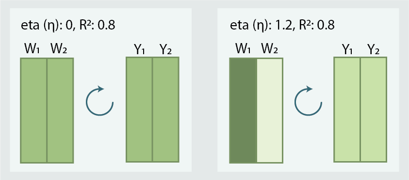
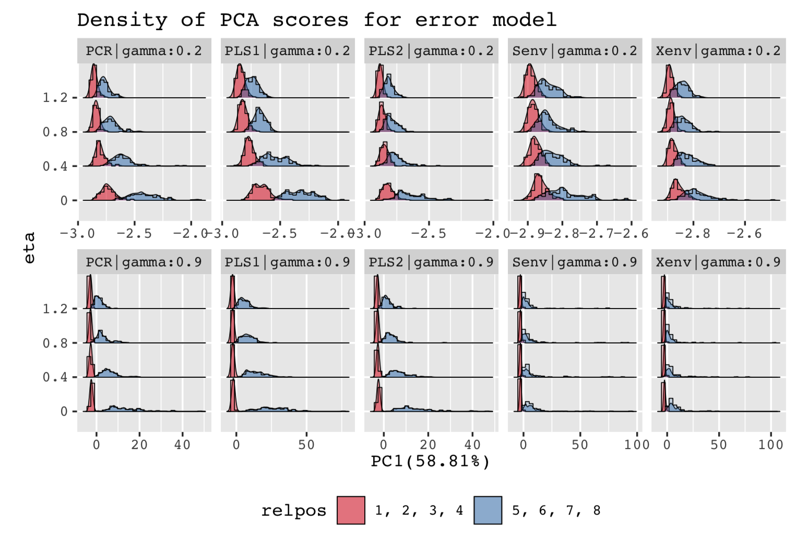
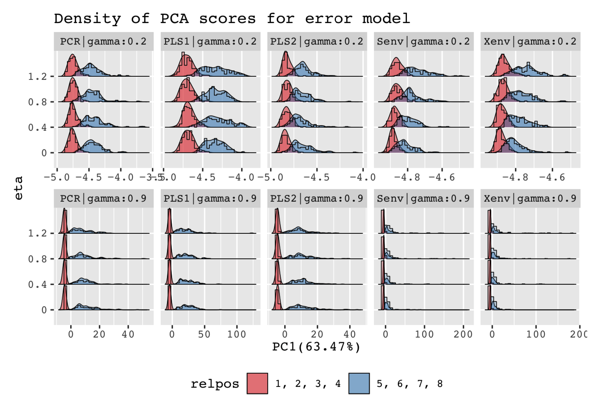

<style>
html{zoom: 1.3;}
</style>

```{r setup, include=FALSE}
knitr::opts_chunk$set(
  echo = TRUE,
  comment = NA
)
source("scripts/01-setup.r")
library(purrr)
```

```{r functions}
get_cov <- function(obj, type = c("y", "x"), digits = 3) {
  ny <- obj$m
  sigma <- obj$Sigma
  out <- switch(
    type, 
    y = sigma[1:ny, 1:ny],
    x = sigma[-c(1:ny), -c(1:ny)])
  rownames(out) <- paste0(toupper(type), 1:nrow(out))
  colnames(out) <- paste0(toupper(type), 1:ncol(out))
  return(round(out, digits = digits))
}

```

```{r}
corcov <- lapply(unique(design$eta), function(e){
  sobj <- design %>% 
    filter(eta == e) %>% 
    get_design(1) %>% 
    simulate()
  covs <- list(
    population = get_cov(sobj, "y"),
    sample = cov(sobj$Y)
  )
  cors <- lapply(covs, cov2cor)
  return(list(cov = covs, cor = cors))
})
names(corcov) <- glue::glue("eta:{unique(design$eta)}")
```

# Response and Response Components


Here, the information content in the response components is same and when rotated they spread out to different response variables. In the case of high `eta` due to large amount of noisy content in uninformative response  the response variables after rotation gets less informative which if modelled alone performes poor and that is what happening with PCR and PLS1 methods. On the other hand, `eta=0` distributes the information in all response components which when rotated will also distribute the same information in all response variables. This will give responses with richer information and low noise which will also be favorable if modelled alone as in the case of PCR and PLS1.

---

# Estimation Error Plot {.tabset}
Here if we scale away the effect of `eta` there is no point in including `eta` in the design. This will reduce our 32 design to just 8 designs. Further the head-to-head comparison with prediction paper will not be possible. In case you might be wondering how the covariance and correlation structure looks like in these different `eta` cases, I have included both sample and population version of them in the following section.

## Before Scaling


## After Scaling



# Structure in Response {.tabset}
## Covariance Structures {.tabset .tabset-pills}
### Population
```{r}
corcov %>% 
  map_depth(2, "population") %>% 
  map("cov") %>% 
  map(round, 3)
```

### Sample
```{r}
corcov %>% 
  map_depth(2, "sample") %>% 
  map("cov") %>% 
  map(round, 3)
```


## Correlation Structures {.tabset .tabset-pills}
### Population
```{r}
corcov %>% 
  map_depth(2, "population") %>% 
  map("cor") %>% 
  map(round, 3)
```

### Sample
```{r}
corcov %>% 
  map_depth(2, "sample") %>% 
  map("cor") %>% 
  map(round, 3)
```


# Our design
```{r}
design_chr %>% 
  rownames_to_column("Design") %>% 
  DT::datatable(rownames = FALSE,
                options = list(dom="tp")) %>% 
  DT::formatStyle(c("Design", names(design_chr)), 
                  fontFamily = "monospace")
```

